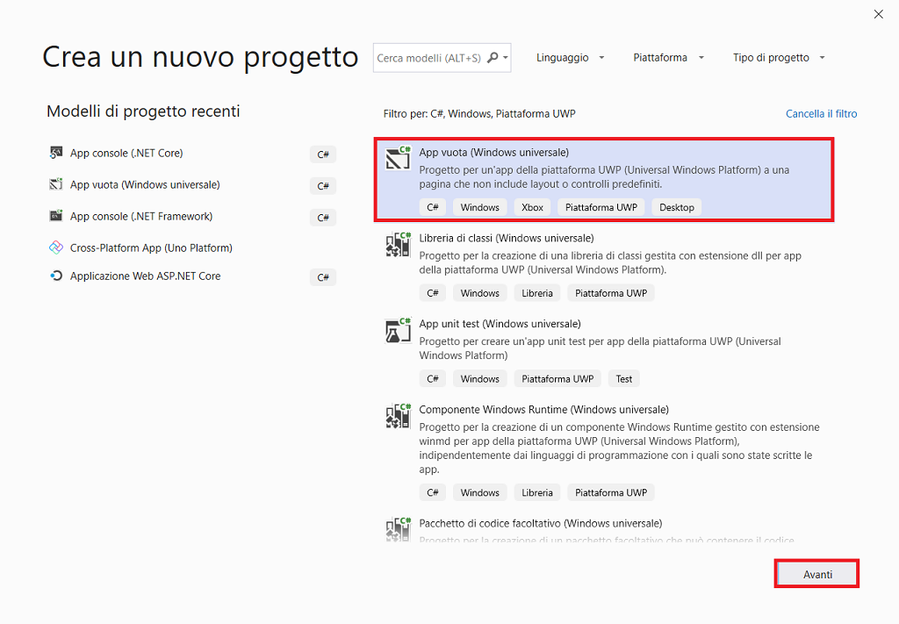

# Emulatore HoloLens

L'emulatore di HoloLens consente di testare app olografiche sul PC senza un HoloLens fisico. Esso comprende anche il set di strumenti di sviluppo HoloLens. L'emulatore utilizza una **VM** (*Virtual Machine*) Hyper-V. Gli ingressi umani e ambientali che di solito sono letti dai sensori di Hololens sono simulati da tastiera, mouse o controller Xbox. Le app non devono essere modificate per funzionare con l'emulatore; le app non sanno che essi non sono in esecuzione su un vero e proprio HoloLens.

Nella pagina [Archivio HoloLens emulatore](https://docs.microsoft.com/en-us/windows/mixed-reality/hololens-emulator-archive) , è possibile trovare le build dell'emulatore HoloLens.

Windows 10 Home Edition non supporta Hyper-V o l'emulatore HoloLens e  richiede l'aggiornamento per Windows 10 ottobre 2018 o versione successiva.

## Input di base

Il cursore su HoloLens (1a generazione) segue il movimento della testa e rotazione. Nell'emulatore 2 HoloLens, il cursore segue il movimento della mano e orientamento.

- **Camminare in avanti, dietro, sinistra e destra** - uso WASD i tasti sulla tastiera o la levetta sinistra su un controller Xbox.
- **Look up, giù, destra e sinistra,** - clicca e trascina il mouse, utilizzare i tasti freccia sulla tastiera o il diritto di attaccare su un controller Xbox.
- **Aria toccare gesto** - fare clic con il mouse, premere il tasto INVIO sulla tastiera, oppure utilizzare il pulsante su un controller Xbox.
- **Gesto di bloom/sistema** - premere il tasto Windows o il tasto F2 sulla tastiera o premere il pulsante B su un controller Xbox.
- **Movimento della mano per lo scorrimento** - contemporaneamente tenere premuto il tasto ALT e il pulsante del mouse a destra e trascinare il mouse fino verso il basso.
- **Orientamento e movimento della mano** (Solo per HoloLens 2 emulatore) - tenere premuto il tasto ALT e trascinare il mouse verso l'alto o verso il basso, sinistra o destra per spostare la mano o utilizzare i tasti freccia e Q o E per ruotare e inclinare la mano. 

##### Finestra principale HoloLens 2

##### Barra degli strumenti

 Contiene i seguenti pulsanti.

-  ***Close***: chiude l'emulatore.
-  ***Minimize***: minimizza la finestra dell'emulatore.
-  ***Show or hide the simulation panel (F7)***: mostra o nasconde il [Pannello di controllo di simulazione](https://docs.microsoft.com/en-us/windows/mixed-reality/using-the-hololens-emulator#simulation-control-panel) per la configurazione e il controllo di [input per l'emulatore](https://docs.microsoft.com/en-us/windows/mixed-reality/using-the-hololens-emulator#basic-emulator-input).
-  ***Fit to Screen***: s'inserisce l'emulatore a schermo.
-  ***Zoom***: rendere l'emulatore più grandi e più piccoli.
-  ***Help***: aprire la Guida di emulatore.
-  ***Open Device Portal***: aprire il portale di periferica di Windows per il sistema operativo HoloLens nell'emulatore.
-  ***Tools***: si apre il pannello di ***Additional Tools*** .

Fare clic su ***Open Device Portal***.

##### Pannello di controllo di simulazione

 Consente di visualizzare la posizione corrente e l'orientamento dei dispositivi simulati umani e d'input. Permette anche di configurare entrambi gli input simulati, ad esempio per mostrare o nascondere una o entrambe le mani e dispositivi utilizzati per il controllo d'input simulato, per esempio il PC tastiera, mouse e gamepad.

# Creare un'app HoloLens C# in Visual Studio

In questa introduzione all'**IDE** (*Integrated Development Environment)* di Visual Studio sarà creata una semplice app per HoloLens. A tale scopo, saranno usati un modello di progetto della piattaforma **UWP** (*Universal Windows Platform*), **XAML** (*Extensible Application Markup Language*)  e il linguaggio di programmazione C#.

Se Visual Studio non è ancora installato, accedere alla pagina [Download di Visual Studio](https://visualstudio.microsoft.com/downloads/?utm_medium=microsoft&utm_source=docs.microsoft.com&utm_campaign=inline+link&utm_content=download+vs2019) per installarlo gratuitamente.

## Creare una soluzione

Per prima cosa è necessario creare un progetto della piattaforma UWP. Il tipo di progetto include fin dall'inizio tutti i file di modello necessari.

Per prima cosa, si creerà un progetto di app C#. Il tipo di progetto include fin dall'inizio tutti i file modello necessari.

1. Aprire Visual Studio 2019.
2. Nella finestra iniziale scegliere ***Crea un nuovo progetto***.
3. Nella finestra ***Crea un nuovo progetto*** immettere o digitare *Windows universale* nella casella di ricerca. Scegliere quindi **C# **  dall'elenco ***Linguaggio*** e ***Windows*** dall'elenco ***Piattaforma***.

Dopo aver applicato i filtri di linguaggio e piattaforma, scegliere il modello ***App vuota (Windows universale)*** e quindi scegliere ***Avanti***.

 Se il modello ***App vuota (Windows universale)*** non è visualizzato, è possibile installarlo dalla finestra ***Crea un nuovo progetto***. Nel messaggio ***L'elemento cercato non è stato trovato?*** scegliere il collegamento ***Installa altri strumenti e funzionalità***.

 Scegliere quindi il carico di lavoro ***Sviluppo di app per la piattaforma UWP (Universal Windows Platform)*** nel programma d'installazione di Visual Studio.

Scegliere quindi il pulsante ***Modifica*** nel programma d'installazione di Visual Studio. Quando è richiesto, salvare il lavoro. Scegliere quindi ***Continua*** per installare il carico di lavoro. 

4. Nella finestra di dialogo ***Nuovo progetto della piattaforma UWP (Universal Windows Platform)*** accettare le impostazioni predefinite per ***Versione di destinazione***: e ***Versione minima***:.

5. Nella finestra ***Configura il nuovo progetto*** digitare o immettere *Primo_Progetto_HoloLens* nella casella ***Nome del progetto***. Scegliere ***Crea***.

Se è la prima volta che si usa Visual Studio per creare app UWP, è possibile che sia visualizzata la finestra di dialogo ***Impostazioni***. Scegliere ***Modalità sviluppatore*** e ***S*ì**.

Visual Studio installa un pacchetto aggiuntivo di modalità sviluppatore per l'utente. Una volta completata l'installazione del pacchetto, chiudere la finestra di dialogo ***Impostazioni***.

## Creare l'app

A questo punto è possibile iniziare a sviluppare l'app. 

## Esecuzione dell'app

L'emulatore dovrebbe avere un aspetto simile al seguente.

 A questo punto è possibile compilare, distribuire e avviare l'app UWP "Primo_Progetto_HoloLens" per verificarne l'aspetto. 

1. Per HoloLens emulatore (1a generazione), assicurarsi che la piattaforma sia impostato su x86. Per l'emulatore di 2 HoloLens,  su x86 o x64.
2. Selezionare la versione di HoloLens emulatore come dispositivo di destinazione per il debug.
3. Fare clic su ***Debug/Avvia debug ( F5)*** per avviare l'emulatore e distribuire l'app.

