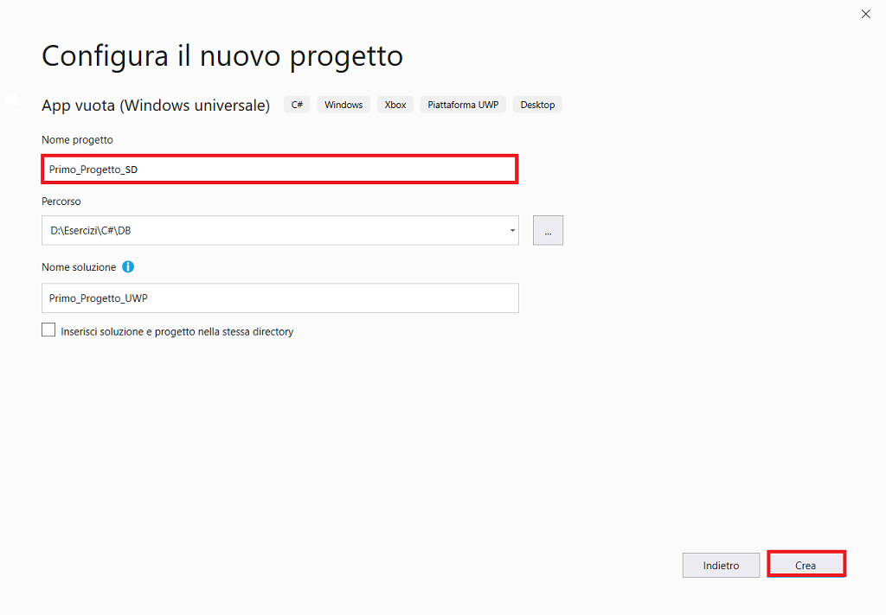
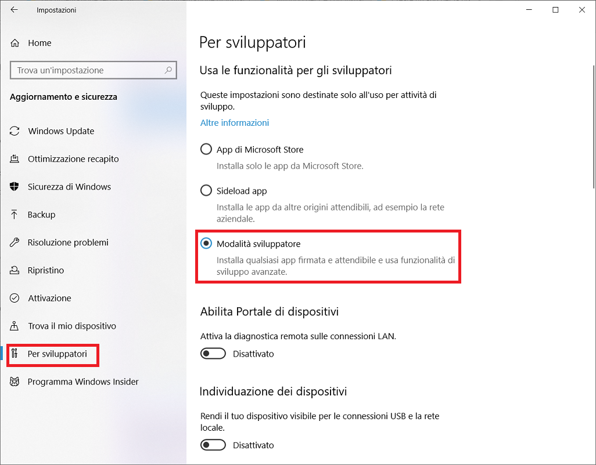
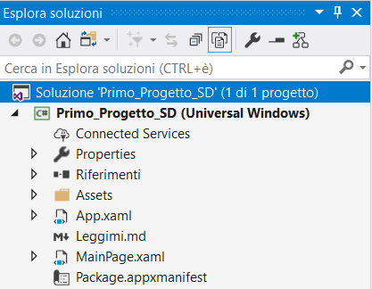
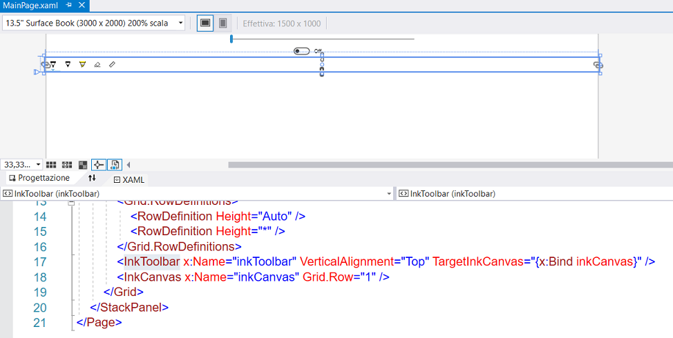
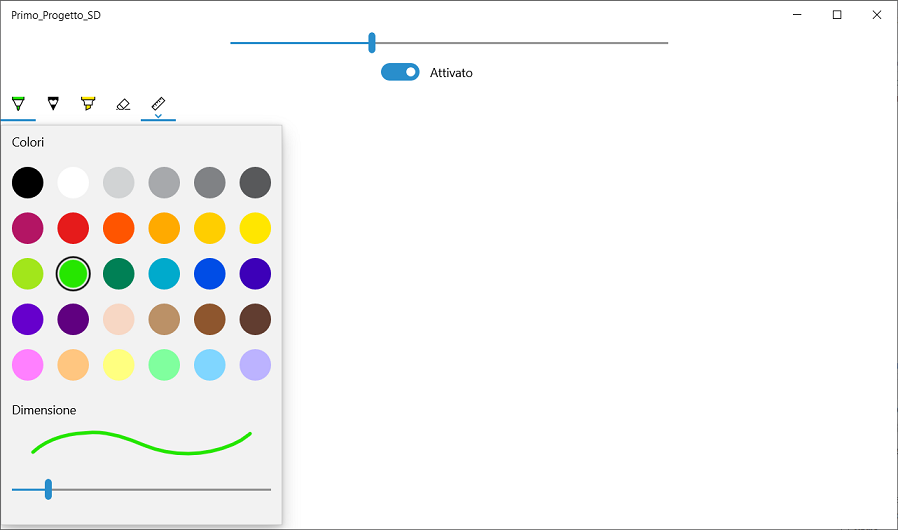

# Creare un'app UWP C# in Visual Studio

In questa introduzione all'**IDE** (*Integrated Development Environment)* di Visual Studio sarà creata una semplice app per Surface Dial. A tale scopo, saranno usati un modello di progetto della piattaforma **UWP** (*Universal Windows Platform*), **XAML** (*Extensible Application Markup Language*)  e il linguaggio di programmazione C#.

Se Visual Studio non è ancora installato, accedere alla pagina [Download di Visual Studio](https://visualstudio.microsoft.com/downloads/?utm_medium=microsoft&utm_source=docs.microsoft.com&utm_campaign=inline+link&utm_content=download+vs2019) per installarlo gratuitamente.


## Creare una soluzione

Per prima cosa è necessario creare un progetto della piattaforma UWP. Il tipo di progetto include fin dall'inizio tutti i file di modello necessari.

Per prima cosa, si creerà un progetto di app C#. Il tipo di progetto include fin dall'inizio tutti i file modello necessari.

1. Aprire Visual Studio 2019.
2. Nella finestra iniziale scegliere ***Crea un nuovo progetto***.
3. Nella finestra ***Crea un nuovo progetto*** immettere o digitare *Windows universale* nella casella di ricerca. Scegliere quindi **C# **  dall'elenco ***Linguaggio*** e ***Windows*** dall'elenco ***Piattaforma***.

Dopo aver applicato i filtri di linguaggio e piattaforma, scegliere il modello ***App vuota (Windows universale)*** e quindi scegliere ***Avanti***.


 Se il modello ***App vuota (Windows universale)*** non è visualizzato, è possibile installarlo dalla finestra ***Crea un nuovo progetto***. Nel messaggio ***L'elemento cercato non è stato trovato?*** scegliere il collegamento ***Installa altri strumenti e funzionalità***.

 Scegliere quindi il carico di lavoro ***Sviluppo di app per la piattaforma UWP (Universal Windows Platform)*** nel programma d'installazione di Visual Studio.

Scegliere quindi il pulsante ***Modifica*** nel programma d'installazione di Visual Studio. Quando è richiesto, salvare il lavoro. Scegliere quindi ***Continua*** per installare il carico di lavoro. 

4. Nella finestra di dialogo ***Nuovo progetto della piattaforma UWP (Universal Windows Platform)*** accettare le impostazioni predefinite per ***Versione di destinazione***: e ***Versione minima***:.


5. Nella finestra ***Configura il nuovo progetto*** digitare o immettere *Primo_Progetto_SD* nella casella ***Nome del progetto***. Scegliere ***Crea***.



Se è la prima volta che si usa Visual Studio per creare app UWP, è possibile che sia visualizzata la finestra di dialogo ***Impostazioni***. Scegliere ***Modalità sviluppatore*** e ***S*ì**.



Visual Studio installa un pacchetto aggiuntivo di modalità sviluppatore per l'utente. Una volta completata l'installazione del pacchetto, chiudere la finestra di dialogo ***Impostazioni***.


## Creare l'app

A questo punto è possibile iniziare a sviluppare l'app. 



Sono disponibili due riquadri.

1. La **finestra di progettazione XAML** che include un'area di progettazione.
2. L'**editor XAML**, dove è possibile aggiungere o cambiare il codice.



In ***Esplora soluzioni*** fare doppio clic su *MainPage.xaml* per aprire una doppia visualizzazione.

File MAINPAGE.XAML

Il Surface Dial è integrato con i controlli ***<InkToolbar>*** e ***<InkCanvas>***.

Quando si apre il menu del Surface Dial in un’app che usa ***<InkToolbar>***, il menu conterrà gli strumenti per controllare il tipo di penna e lo spessore della punta.

```xaml
<Page
    x:Class="Primo_Progetto_SD.MainPage"
    xmlns="http://schemas.microsoft.com/winfx/2006/xaml/presentation"
    xmlns:x="http://schemas.microsoft.com/winfx/2006/xaml"
    xmlns:local="using:Primo_Progetto_SD"
    xmlns:d="http://schemas.microsoft.com/expression/blend/2008"
    xmlns:mc="http://schemas.openxmlformats.org/markup-compatibility/2006"
    mc:Ignorable="d">
    <StackPanel Background="{ThemeResource ApplicationPageBackgroundThemeBrush}">
        <Slider x:Name="RotationSlider" Width="500" HorizontalAlignment="Center" />
        <ToggleSwitch x:Name="ButtonToggle" HorizontalAlignment="Center" />
        <Grid>
            <Grid.RowDefinitions>
                <RowDefinition Height="Auto" />
                <RowDefinition Height="*" />
            </Grid.RowDefinitions>
            <InkToolbar x:Name="inkToolbar" VerticalAlignment="Top" TargetInkCanvas="{x:Bind inkCanvas}" />
            <InkCanvas x:Name="inkCanvas" Grid.Row="1" />
        </Grid>
    </StackPanel>
</Page>
```

File MAINPAGE.XAML.CS

```csharp
using System;
using Windows.Storage.Streams;
using Windows.UI.Input;
using Windows.UI.Xaml.Controls;

namespace Primo_Progetto_SD
{
    public sealed partial class MainPage : Page
    {
        private RadialController controller;

        public MainPage()
        {
            this.InitializeComponent();
            // inizializzo l'oggetto
            controller = RadialController.CreateForCurrentView();
            // creo una icona per lo strumento personalizzato
            RandomAccessStreamReference icon = RandomAccessStreamReference.CreateFromUri(new Uri("ms-appx:///Assets/StoreLogo.png"));
            // creo un menu item per lo strumento personalizzato
            RadialControllerMenuItem myItem = RadialControllerMenuItem.CreateFromIcon("Sample", icon);
            // aggiungo lo strumento personalizzato al menu di RadialController
            controller.Menu.Items.Add(myItem);
            // aggiungo gli handler per gli eventi del RadialController
            controller.ButtonClicked += Controller_ButtonClicked;
            controller.RotationChanged += Controller_RotationChanged;
        }

        // Handler per la rotazione del RadialController
        private void Controller_RotationChanged(RadialController sender, RadialControllerRotationChangedEventArgs args)
        {
            if (RotationSlider.Value + args.RotationDeltaInDegrees > 100)
            {
                RotationSlider.Value = 100;
                return;
            }
            else if (RotationSlider.Value + args.RotationDeltaInDegrees < 0)
            {
                RotationSlider.Value = 0;
                return;
            }
            RotationSlider.Value += args.RotationDeltaInDegrees;
        }

        // Handler il clic del RadialController.
        private void Controller_ButtonClicked(RadialController sender, RadialControllerButtonClickedEventArgs args)
        { ButtonToggle.IsOn = !ButtonToggle.IsOn; }
    }
}
```


## Esecuzione dell'app

 A questo punto è possibile compilare, distribuire e avviare l'app UWP "Primo_Progetto_SD" per verificarne l'aspetto, si avranno due voci nel menu radiale.

1. La gestione della selezione delle penne.
2. La gestione della dimensione della penna.

1. Usare il pulsante di riproduzione (include il testo **Computer locale**) per avviare l'app nel PC locale.

