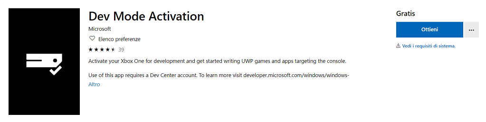

# Lettore multimediale

Xbox è un vero e proprio dispositivo multimediale al centro del salotto in grado di gestire foto e video direttamente in TV.

L'app permette di accedere ai file presenti su una memoria esterna **USB** (*Universal Serial Bus*) o H/D e di visualizzarli.

Bisogna progettare anche un metodo per visualizzare file e cartelle vista la mancanza di **Esplora file** su Xbox.

Bisogna progettare anche un metodo per utilizzare il gamepad eliminando la modalità mouse presente di default.

L'Xbox dev'essere abilitata alla modalità sviluppatore, per fare questo scaricare dallo store l'app **DevModeActivatio**n.



Sarà fornito un codice che dev'essere inserito all'[indirizzo](https://developer.microsoft.com/en-us/XboxDevices).

Dopo il riavvio dell'Xbox, nella nuova home sulla destra ci sarà una nuova app DevHome che fornisce i dettagli dell'Xbox e permette la connessione a Visual Studio.


# Creare un'app UWP C# in Visual Studio

In questa introduzione all'**IDE** (*Integrated Development Environment)* di Visual Studio sarà creata una semplice app per Xbox. A tale scopo, saranno usati un modello di progetto della piattaforma **UWP** (*Universal Windows Platform*), **XAML** (*Extensible Application Markup Language*)  e il linguaggio di programmazione C#.

Se Visual Studio non è ancora installato, accedere alla pagina [Download di Visual Studio](https://visualstudio.microsoft.com/downloads/?utm_medium=microsoft&utm_source=docs.microsoft.com&utm_campaign=inline+link&utm_content=download+vs2019) per installarlo gratuitamente.


## Creare una soluzione

Per prima cosa è necessario creare un progetto della piattaforma UWP. Il tipo di progetto include fin dall'inizio tutti i file di modello necessari.

Per prima cosa, si creerà un progetto di app C#. Il tipo di progetto include fin dall'inizio tutti i file modello necessari.

1. Aprire Visual Studio 2019.
2. Nella finestra iniziale scegliere ***Crea un nuovo progetto***.
3. Nella finestra ***Crea un nuovo progetto*** immettere o digitare *Windows universale* nella casella di ricerca. Scegliere quindi **C# **  dall'elenco ***Linguaggio*** e ***Windows*** dall'elenco ***Piattaforma***.

Dopo aver applicato i filtri di linguaggio e piattaforma, scegliere il modello ***App vuota (Windows universale)*** e quindi scegliere ***Avanti***.


 Se il modello ***App vuota (Windows universale)*** non è visualizzato, è possibile installarlo dalla finestra ***Crea un nuovo progetto***. Nel messaggio ***L'elemento cercato non è stato trovato?*** scegliere il collegamento ***Installa altri strumenti e funzionalità***.

 Scegliere quindi il carico di lavoro ***Sviluppo di app per la piattaforma UWP (Universal Windows Platform)*** nel programma d'installazione di Visual Studio.

Scegliere quindi il pulsante ***Modifica*** nel programma d'installazione di Visual Studio. Quando è richiesto, salvare il lavoro. Scegliere quindi ***Continua*** per installare il carico di lavoro. 

4. Nella finestra di dialogo ***Nuovo progetto della piattaforma UWP (Universal Windows Platform)*** accettare le impostazioni predefinite per ***Versione di destinazione***: e ***Versione minima***:.


5. Nella finestra ***Configura il nuovo progetto*** digitare o immettere *Controller* nella casella ***Nome del progetto***. Scegliere ***Crea***.


Se è la prima volta che si usa Visual Studio per creare app UWP, è possibile che sia visualizzata la finestra di dialogo ***Impostazioni***. Scegliere ***Modalità sviluppatore*** e ***S*ì**.


Visual Studio installa un pacchetto aggiuntivo di modalità sviluppatore per l'utente. Una volta completata l'installazione del pacchetto, chiudere la finestra di dialogo ***Impostazioni***.


## Creare l'app

A questo punto è possibile iniziare a sviluppare l'app. 

In questa soluzione, si è costruito un loop infinito per leggere i valori dei pulsanti premuti ogni 5 millisecondi. 
Il valore del trigger sinistro è un valore compreso tra 0 e 1 che sta ad indicare il livello di forza applicata,
mentre `HasFlag` indica con un valore booleano se il pulsante "A" è stato premuto oppure no.

Ottimizzo l'app per essere eseguita su Xbox.

- Eliminazione della modalità mouse.
- Aggiunta di un metodo per eliminare la visualizzazione della lista dei file e visualizzare il media a tutta pagina.
- Rimozione dell'area di sicurezza intorno all'app (safe area).

Non tutte le TV consentono di visualizzare il contenuto dello schermo fino ai bordi dello stesso per motivi tecnologici.
Per impostazione predefinita, UWP lascia un'area sicura intorno all'app per evitare che una porzione dell'app possa essere non visibile e la riempie con il colore di fondo dell'app.


Sono disponibili due riquadri.

1. La **finestra di progettazione XAML** che include un'area di progettazione.
2. L'**editor XAML**, dove è possibile aggiungere o cambiare il codice.


File MainPage.xaml

- Nella parte sinistra una Grid contenente un oggetto Image e un `MediaElement`, si può visualizzare solo immagini o solo  video, una textblock per visualizzare un messaggio all'avvio di selezionare un file.
- Nella parte destra una ListView per la navigazione tra le cartelle e la selezione degli elementi da visualizzare (nell'Xbox non è implementato il `FolderPicker`)

```xaml
<Page
    x:Class="XBox1.MainPage"
    xmlns="http://schemas.microsoft.com/winfx/2006/xaml/presentation"
    xmlns:x="http://schemas.microsoft.com/winfx/2006/xaml"
    xmlns:local="using:XBox1"
    xmlns:d="http://schemas.microsoft.com/expression/blend/2008"
    xmlns:mc="http://schemas.openxmlformats.org/markup-compatibility/2006"
    mc:Ignorable="d">
    <Grid Background="{ThemeResource ApplicationPageBackgroundThemeBrush}">
        <Grid.ColumnDefinitions>
            <ColumnDefinition Width="*"></ColumnDefinition>
            <ColumnDefinition Width="Auto"></ColumnDefinition>
        </Grid.ColumnDefinitions>
        <Grid x:Name="GridLeft" Grid.Column="0">
            <Image x:Name="Image1" />
            <MediaElement x:Name="me"></MediaElement>
        </Grid>
        <Grid x:Name="rightGrid" Grid.Column="1" Width="200">
            <ListView x:Name="listView">
                <ListView.ItemTemplate>
                    <DataTemplate>
                        <Grid>
                            <TextBlock Text="{Binding Name}"></TextBlock>
                        </Grid>
                    </DataTemplate>
                </ListView.ItemTemplate>
            </ListView>
        </Grid>
    </Grid>
</Page>
```

File Package.appxmanifest


## Esecuzione dell'app

 A questo punto è possibile compilare, distribuire e avviare l'app UWP "Controller" per verificarne l'aspetto.

Usare il pulsante di riproduzione (include il testo **Computer locale**) per avviare l'app nel PC locale.


## Sviluppi futuri

- Controlli gestione video: play, stop, pause, avanti o e indietro.
- Zoom delle immagini con i pulsanti del gamepad.


